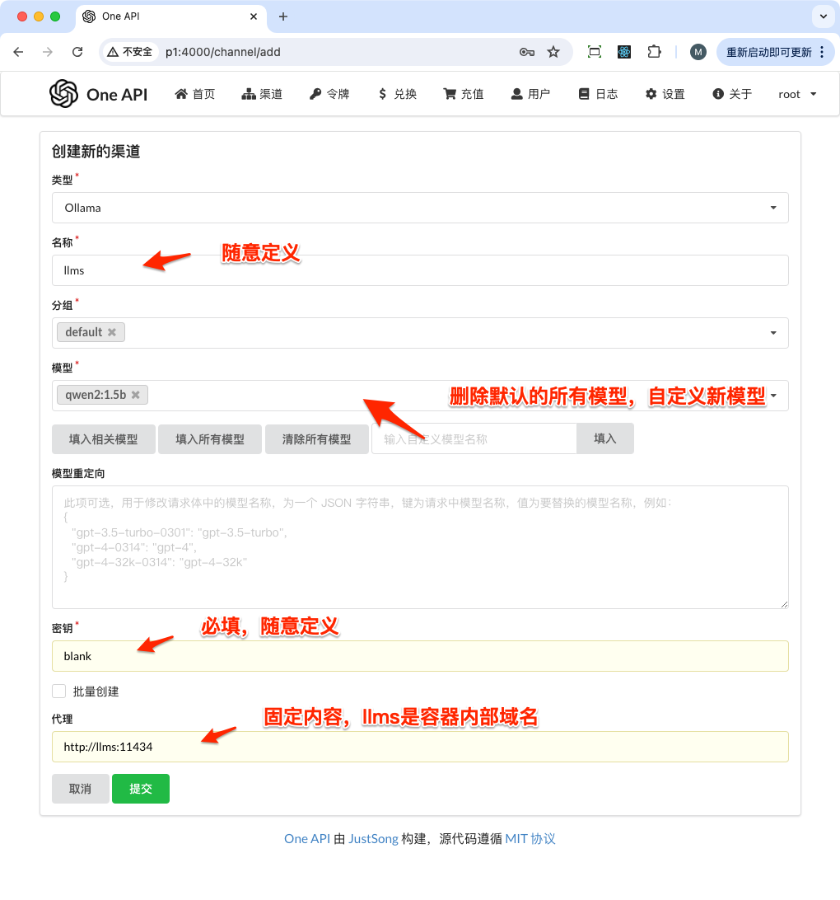
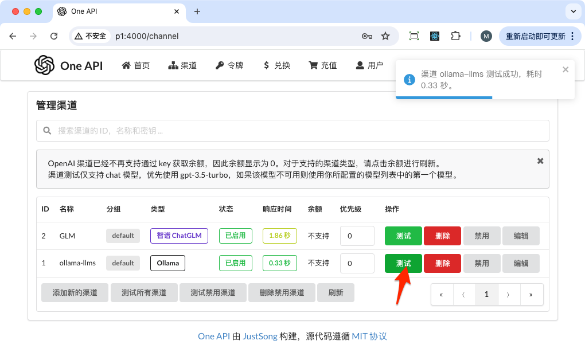
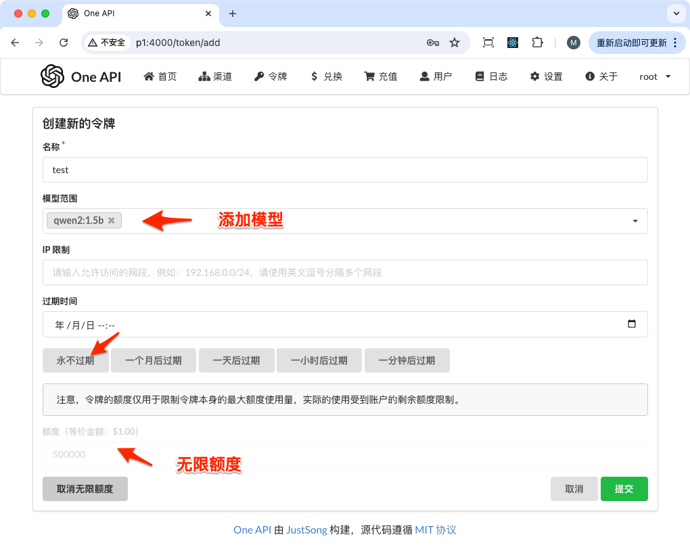
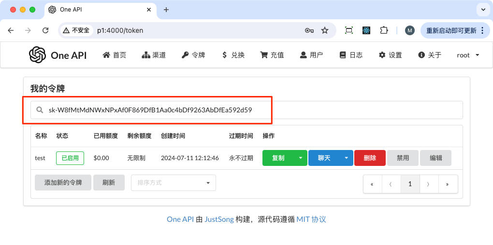
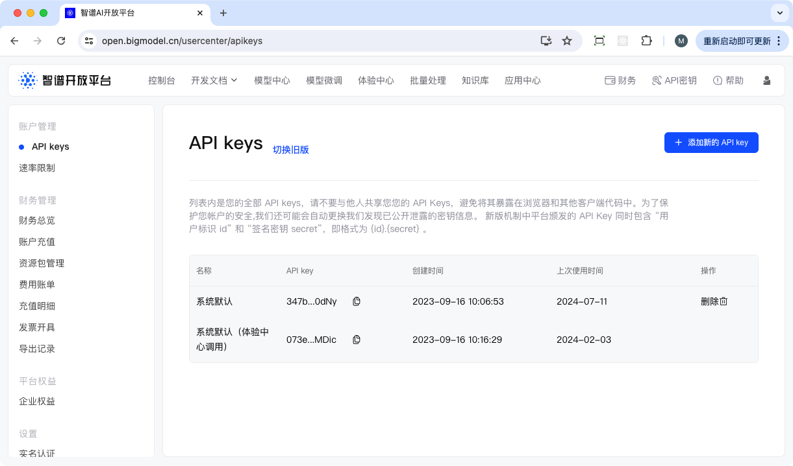
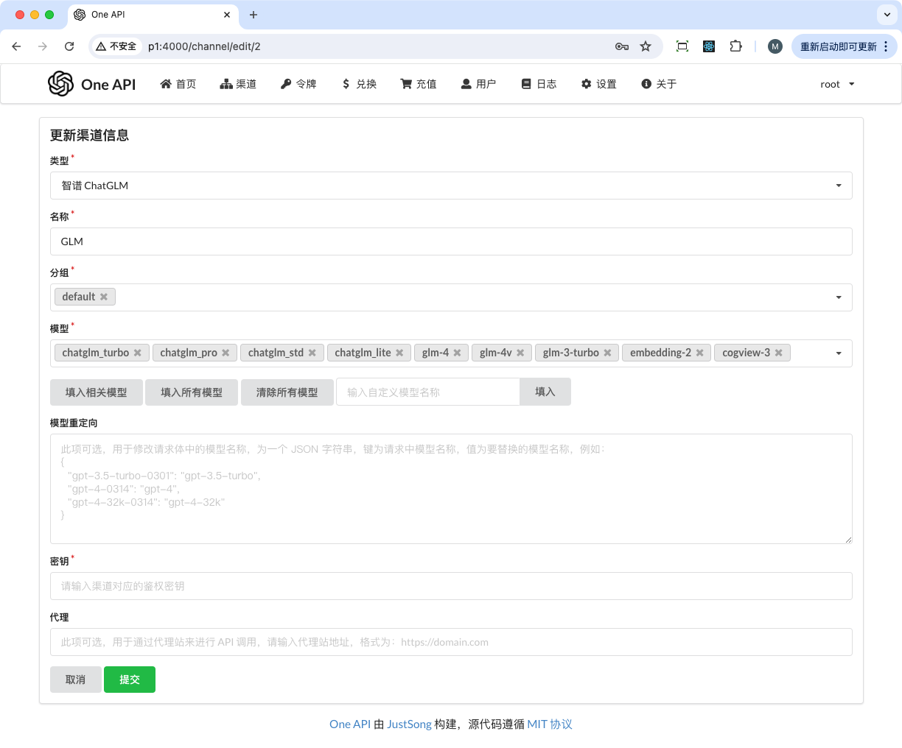

<!-- @import "[TOC]" {cmd="toc" depthFrom=1 depthTo=6 orderedList=false} -->

<!-- code_chunk_output -->

- [LLM Proto](#llm-proto)
  - [如何启动服务](#如何启动服务)
  - [配置服务](#配置服务)
    - [配置 ollama](#配置-ollama)
    - [配置 one-api](#配置-one-api)
      - [设置本地模型](#设置本地模型)
      - [设置云端模型](#设置云端模型)
  - [访问 jupyterlab](#访问-jupyterlab)

<!-- /code_chunk_output -->


# LLM Proto

[TOC]

---

搭建一个 LLM 开发环境：

- 可以在 4GB 显存的 nvidia 显卡下正常运行（gtx 1650 测试通过）
- 基于 [Ollama](https://ollama.com/) 加载本地模型
- 可以基于 Qwen2 1.5b 或者更小的 Qwen2 0.5b，这样可以运行在小于 4GB 显存下
- 使用 [songquanpeng/one-api](https://github.com/songquanpeng/one-api) 统一本地模型和云端模型接口为 OpenAI API
- 通过 Jupyterlab notebook 编写模型相关代码

环境使用：


## 如何启动服务

使用 docker compose 启动 3 个服务：

- ollama
- one-api
- jupyterlab

构建 jupyterlab docker 镜像：

```bash
cd jupyterlab
./build.sh
```

启动服务：

```bash
docker compose up -d

# 确认服务正常启动
docker compose ps
NAME      IMAGE              COMMAND                  SERVICE   CREATED       STATUS       PORTS
llms      ollama/ollama      "/bin/ollama serve"      ollama    2 hours ago   Up 2 hours   0.0.0.0:11434->11434/tcp, :::11434->11434/tcp
mylab     mylab              "/opt/nvidia/nvidia_…"   mylab     2 hours ago   Up 2 hours   0.0.0.0:8888->8888/tcp, :::8888->8888/tcp
oneapi    justsong/one-api   "/one-api"
```

## 配置服务

### 配置 ollama

需要为 Ollama 加入 `qwen2:1.5b` 模型：

```bash
# 进入 ollama 容器
docker exec -it llms bash

# 拉取模型
ollama pull qwen2:1.5b

# 验证拉取成功
ollama ls
NAME            ID              SIZE    MODIFIED
qwen2:1.5b      f6daf2b25194    934 MB  5 hours ago
```

### 配置 one-api

访问： `http://IP:4000`

登录账号/密码： `root/123456`

#### 设置本地模型

添加渠道：



测试渠道：



添加令牌：



复制令牌备用：



#### 设置云端模型

以 [智谱 GLM](https://open.bigmodel.cn/overview) 为例



创建渠道（需要设置访问密钥）：



其他与本地模型流程相同。

## 访问 jupyterlab

浏览器访问 `http://IP:8888`

密码是 `password`

编写笔记，参考 [MarshalW/jupyterlab-demos/blob/main/simple-oneapi.ipynb](https://github.com/MarshalW/jupyterlab-demos/blob/main/simple-oneapi.ipynb)